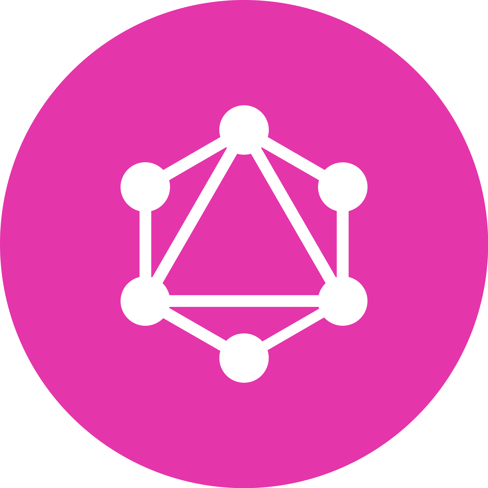
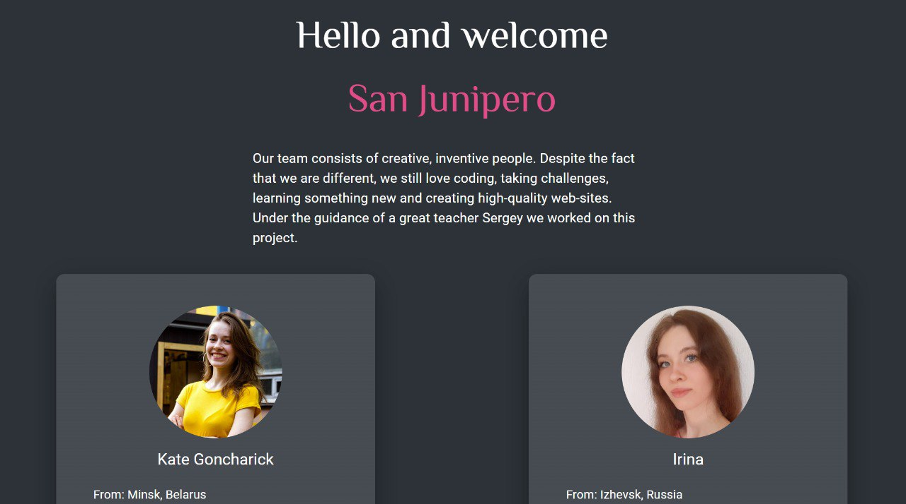

<!-- PROJECT FAVICON -->
 

  
 
  <h2>RS School React 2023 Q4</h2>
  <h1 align="center">GraphiQL Final Task</h1>

GraphiQL is a playground/IDE for graphQL requests. After login, you can choose any endpoint, construct a request, prettify your code and get a formatted response. Add some variables and headers? No problem! Use variables/headers tabs for it. And don't forget to check out documentation of chosen api in special section.
 
 

 
 

## Team project by [Sergey](https://github.com/gentoosiast), [Irina](https://github.com/Irina-Grebennikova), and [Kate](https://github.com/KateGoncharik).

[The Rolling Scopes School React Course](https://rs.school/react/) | [Link to the task](https://github.com/rolling-scopes-school/tasks/tree/master/tasks/eCommerce-Application)

_Completed: December 2023_

####

### Technology stack

- [![HTML5][HTML5]][HTML5-url]
- [![CSS][CSS]][CSS-url]
- [![Mui][Mui]][Mui-url]
- [![TypeScript][TypeScript]][TypeScript-url]
- [![React][React]][React-url]
- [![Firebase][Firebase]][Firebase-url]

 
 

<!-- TABLE OF CONTENTS -->

  
Table of Contents

  <ol>
    <li><a href="#technology-stack">Technology stack</a></li>
    <li>
      <a href="#getting-started">Getting Started</a>
      <ul>
       <li><a href="#installation">Installation</a></li>
      </ul>
    </li>
    
  </ol>

 

<!-- GETTING STARTED -->

## Getting Started

To get a local copy - follow these simple example steps.

### Installation

1. Clone the repo

   git clone https://github.com/gentoosiast/graphiql-app

2. Install NPM packages

   `npm install`

3. Start project

   ` npm run dev`

(<a href="#readme-top">back to top</a>)

<!-- CONTACT -->

## Contact

We are freindly! Feel free to send us your feedback.

#### Team leader [Sergey](https://github.com/gentoosiast)

#### Hard-working developers [Irina](https://github.com/Irina-Grebennikova) and [Kate](https://github.com/KateGoncharik)

(<a href="#readme-top">back to top</a>)

